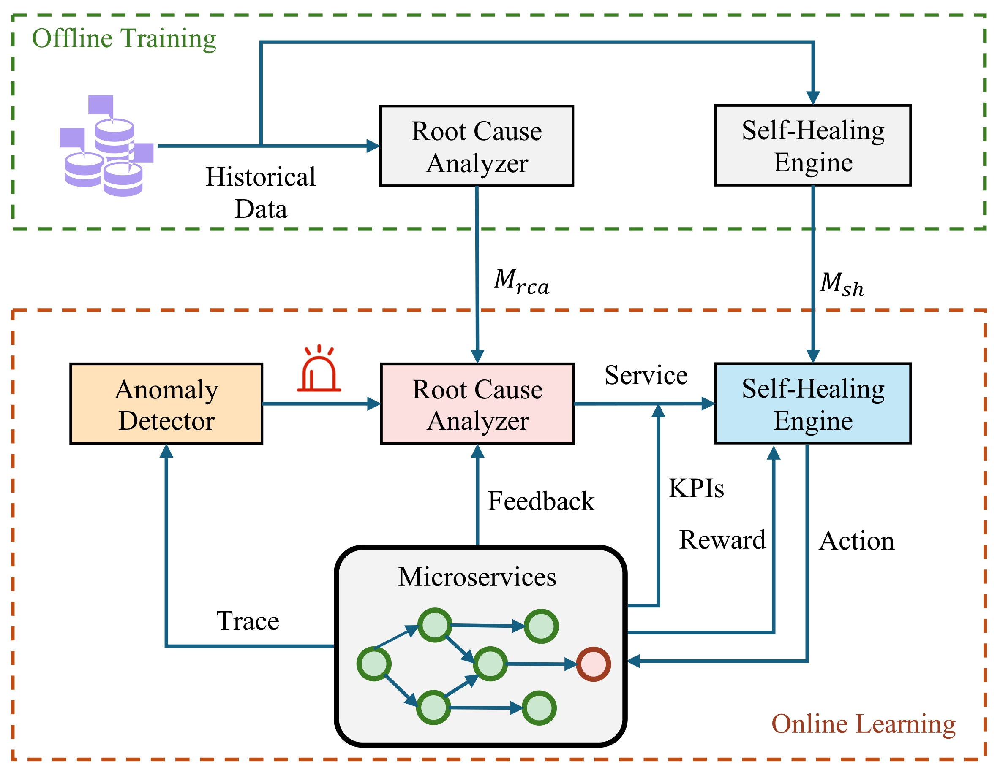

# CloudSH: Online Learning Based Self-Healing for Cloud-Native Systems

We propose **CloudSH**, a lightweight online learning-based self-healing framework that dynamically optimizes fault mitigation strategies for cloud-native environments. CloudSH leverages Spectrum-Based Fault Localization (SBFL) and feedback-enhanced PageRank for root cause identification, significantly reducing unnecessary self-healing actions. Furthermore, a Contextual Multi-Armed Bandit (CMAB) algorithm, LinUCB, is employed to continuously learn from real-time system feedback, improving decision-making efficiency. 

Figure 1.  Overview of CloudSH.

## Quickly Start

> The code is comming soon……

## File Content